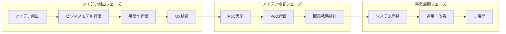
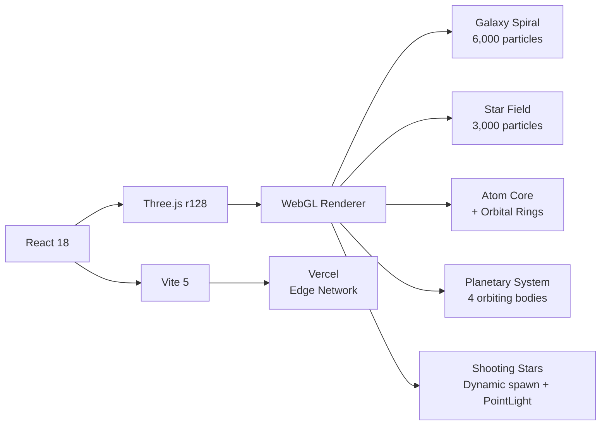

<picture>
  <source media="(prefers-color-scheme: dark)" srcset="https://sophiate.co.jp/wp-content/uploads/2024/03/logo-transparent-4-e1712122694363.png">
  <source media="(prefers-color-scheme: light)" srcset="https://sophiate.co.jp/wp-content/uploads/2024/04/logo-scaled-e1712122657453.jpg">
  
</picture>

# 株式会社ソフィエイト — Sophiate Inc.

### 企画から伴走する、プロダクト共創開発。

[](https://sophiate.co.jp/)
[](https://sophiate.co.jp/business-record/)
[](https://sophiate.co.jp/contact/)
[](https://estimate.sophiate.co.jp/)

> *リアルとデジタルの融合で、クリエイティブな時間を最大化し、最高の体験価値を提供する。*

---

## 🌐 About Us

筑波大学発のテックカンパニーとして **2021年** に創業。東京・新宿区四谷を拠点に、アカデミックな知見を背景に持つエンジニア集団が、業務管理系システムの構築から新規事業のWeb/アプリ開発まで、**企画 → 設計 → 開発 → 運用** を一気通貫で支援しています。

私たちは開発の下請けではありません。貴社の事業を成功させる **「共同創業者」** です。
「何を創るか」から共に悩み、「どうすれば成功するか」まで徹底的に考え抜きます。

|  |  |
|:---|:---|
| **会社名** | 株式会社ソフィエイト |
| **設立** | 2021年 |
| **代表者** | 川島 碩介 |
| **所在地** | 東京都新宿区四谷三栄町6丁目5番地 |
| **体制** | 約50名（代表1名・社員5名・業務委託40名超） |
| **事業内容** | システム・AI開発 / ITコンサルティング / UI・UXデザイン |

---

## 🏗 Why Sophiate? — 選ばれる3つの理由

### 01 — 事業を"自分ごと"として捉える「共創力」

「こんなことをやりたい」という **0→1の構想段階** からご相談ください。市場・ユーザー・技術の3つの観点から事業の解像度を高め、成功確度の高いプロダクト戦略を共に描きます。言われたことをやるだけの開発会社ではなく、**主体的なパートナー** として伴走します。

### 02 — 筑波大学発の「技術力」がアイデアを形にする

アカデミックな知見を背景に持つエンジニア集団が、複雑なアイデアを最適な技術で実現します。AI、最新のWeb技術など、常に最適な **「技術の処方箋」** を提供します。

### 03 — 失敗しないための「開発手法」

**"小さく生んで、大きく育てる"** — 最初から完璧を目指しません。まずはユーザーにとって本当に価値のあるコア機能（MVP）を迅速に開発。アジャイル開発のアプローチにより、開発途中の仕様変更にも柔軟に対応し、本当に「使われる」プロダクトへと進化させ続けます。

---

## 🔧 Services

```
┌─────────────────────────────────────────────────────────────────────────┐
│                                                                         │
│   💡 事業開発 / DXコンサルティング    戦略立案・業務改善・補助金活用支援    │
│   📱 Webシステム / スマホアプリ開発   企画〜要件定義〜開発〜運用を一貫支援  │
│   🤖 AI活用ソリューション            データ分析・最適化・業務自動化        │
│   🎨 UI/UX デザイン                  情報設計・プロトタイピング・デザイン  │
│   🔩 ハードウェア連携開発            IoT・ロボット・小規模開発/改造       │
│   📋 補助金支援                      ものづくり・省力化補助金の申請支援    │
│   ⚡ SES                             エンジニアリソースの提供              │
│                                                                         │
└─────────────────────────────────────────────────────────────────────────┘
```

### 事業フェーズ別 ワンストップ支援



### 開発フロー

```
  ①              ②              ③              ④              ⑤              ⑥
┌──────┐      ┌──────┐      ┌──────┐      ┌──────┐      ┌──────┐      ┌──────┐
│ヒアリング│ ──▶ │ ご提案  │ ──▶ │  設計   │ ──▶ │  開発   │ ──▶ │リリース│ ──▶ │ 運用   │
│事業理解 │      │要件定義 │      │デザイン │      │ テスト  │      │       │      │ 改善   │
└──────┘      └──────┘      └──────┘      └──────┘      └──────┘      └──────┘
```

> 全てのプロセスにおいて、お客様との **密なコミュニケーション** を最も大切にしています。

---

## 🛠 Tech Stack

### Frontend


### Backend


### AI / ML


### Infrastructure & DevOps


### Design & Tools


---

## 📊 Track Record — 開発実績

toB・toCを問わず、多様な領域でのプロダクト開発実績があります。

| 案件 | 内容 | 成果 |
|:---|:---|:---|
| **TCG業界特化POSレジシステム** | 店舗向け業界特化POSを開発。ハードウェア連携まで含めて運用を安定化 | 全国 **150店舗** 導入進行中 |
| **TCGユーザー向け資産管理アプリ** | カード資産をアプリで一元管理。店舗POS連携で取引・管理をスムーズに | ユーザー **22万人** 突破 |
| **SNSマーケティング自動化ツール** | 広告運用の停止・入稿判断・確認作業を仕組み化。スマホで完結する運用体制を実現 | 出先でもスマホで管理可能 |
| **独自ECサイト（フルスクラッチ）** | 既製品では満たせない要件に合わせ、ECを0→1で開発。同時アクセス対策・セキュリティまで設計 | — |
| **人事向け面談日程調整システム** | 月200件規模の面談調整を自動化。面接官200名超のカレンダーを統合管理 | 稼働 **70%削減** |
| **インバウンド旅行者向けモバイルアプリ** | 訪日旅行者向けチャットアプリ。多言語対応＋海外文化を考慮したUXを実装 | — |
| **介護施設向けリハビリ管理システム** | リハビリ業務をポイント管理＋記録で見える化。現場フロー重視の設計 | — |
| **モバイルオーダー＋ドリンクロボット連携** | 注文からドリンク作成までを自動化。ハードウェア連携で省人化と提供スピード向上 | 要望通り全実装完了 |
| **補助金業界AIコンサル** | 業務フローを分解し、システム化/AI適用領域を特定。導入優先度と実行計画まで提案 | — |
| **ナレトレくん（自社サービス）** | 社内ナレッジから問題を自動生成・配信。OJT/研修の理解度測定で育成を仕組み化 | リリース済 |

### 取引先パートナー

`PROGRIT` `NAHATO` `Haskey` `Mycalinks` `Tleez` `Kyrios` `デジマケ` `LUNA` `HUMAN LIFE` `ACCELERATE BIO` ほか多数

---

## 👥 Team — コアメンバー

| Name | Role | Background |
|:---|:---|:---|
| **川島 碩介** | 代表取締役 | 筑波大学院 情報工学研究群サービス工学出身。大規模システムのディレクション・設計業務を経て創業 |
| **反町 太雅** | Director | 前職のSIer企業でトレーサビリティ・ブロックチェーン・品質管理関連の業務システム開発を担当。現在はPM・営業を統括 |
| **白尾 颯真** | PMO & Software Engineer | 筑波大学 理工学群出身。新規事業系Webアプリ・スマホアプリの開発を複数社で経験 |
| **佐藤 久作** | PMO & Software Engineer | 前職で業務系Webアプリケーションの開発を経験。現在はPMO・開発を担当 |

---

## 📐 契約形態

開発規模や事業フェーズに応じて、柔軟な契約形態をご提案します。

| 形態 | 適したケース | 特徴 |
|:---|:---|:---|
| **コンサル契約** | 業務/ワークフロー整理、要求定義、市場分析 | プロジェクトの方向性を強固にしたい方向け |
| **準委任契約** | 仕様が流動的・途中で仕様変更がありそう | プロセスに対して報酬。月額制での対応も可能 |
| **請負契約** | 成果物・仕様（要件）が明確に決まっている | 要件定義が決まってからスタート。結果に対して報酬 |

---

## 📂 このリポジトリについて

本リポジトリは、弊社の **インタラクティブ紹介ページ** のソースコードです。
Three.js によるリアルタイム3Dレンダリングで、銀河・原子軌道・流れ星が交差する没入感のある体験を提供します。

### アーキテクチャ



### 主な演出

| 演出 | 技術 | 詳細 |
|:---|:---|:---|
| **銀河渦巻き** | BufferGeometry + VertexColors | 4アームのスパイラル構造、距離に応じた色グラデーション |
| **原子コア** | Phong Shading + Multi-layer Glow | 呼吸するように脈動するブランドカラーの球体 |
| **惑星軌道** | Parametric Animation | 異なる速度・距離で周回する4天体＋トレイル |
| **流れ星** | Dynamic Instancing + PointLight | 3層グローハロー、リアルタイムライティング、テールパーティクル |
| **マウス追従カメラ** | Lerp Interpolation | マウス位置に応じた視差効果 |

### ローカル開発

```bash
npm install
npm run dev       # → http://localhost:5173
npm run build     # 本番ビルド
```

### プロジェクト構成

```
sophiate-cta/
├── index.html             # エントリーポイント（OGP / meta設定）
├── vite.config.js         # Vite設定（React プラグイン）
├── package.json
└── src/
    ├── main.jsx            # ReactDOM マウント
    └── SophiateGalaxy.jsx  # メインコンポーネント（Three.js シーン全体）
```

---

## 📬 Contact

お気軽にご相談ください。アイデアの壁打ちから、既存システムの課題相談まで対応します。

| | |
|:---|:---|
| 🌐 **Website** | [sophiate.co.jp](https://sophiate.co.jp/) |
| 💼 **取引実績** | [sophiate.co.jp/business-record](https://sophiate.co.jp/business-record/) |
| 📧 **Email** | [contact@sophiate.co.jp](mailto:contact@sophiate.co.jp) |
| 🧮 **自動見積もり** | [estimate.sophiate.co.jp](https://estimate.sophiate.co.jp/) |
| 📅 **無料相談（30分）** | [Googleカレンダーで日程を選ぶ →](https://calendar.app.google/A5zZKHUzubjC2jou5) |

---

<div align="center">

**人間がやらなくていい仕事は、全て効率化できます。**

**Built with** ⚛️ React **+** 🎮 Three.js **+** ⚡ Vite

**© 2025 Sophiate Inc.** All rights reserved.

</div>
